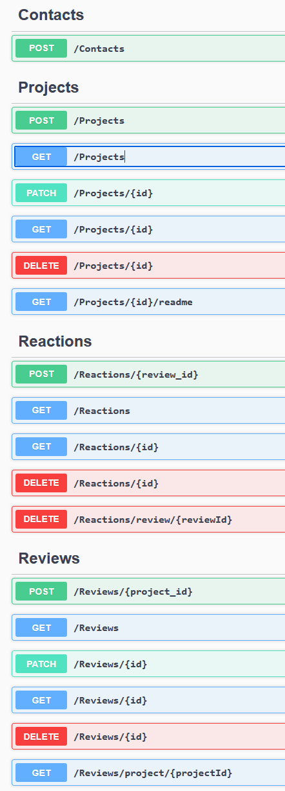
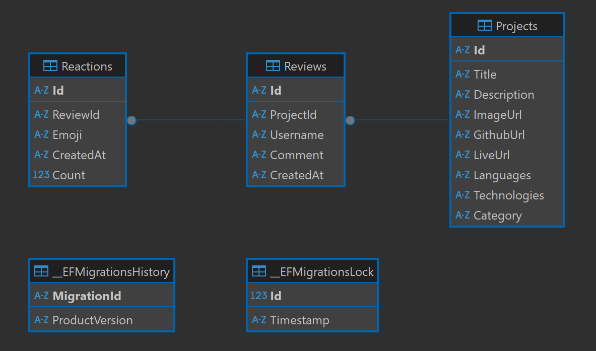

# 🧭 Personal Portfolio — Fullstack Developer Website

Welcome to my personal portfolio — a project designed to present my skills, projects, experience, and technical profile as a developer.

---

## 📌 Project Goals

- Present my CV, skillset, and experience
- Showcase real-world pet projects
- Allow users to leave reviews and feedback
- Serve as a professional, digital business card

---

## 🧱 Architecture

### 💻 Frontend

- **Next.js (React)** — modern framework for SSR/SSG
- **JavaScrypt** — strong typing for reliability
- **CSS** — beautiful UI components

### ⚙️ Backend

- **ASP.NET Core Web API** — REST API for projects and reviews
- **SQLite** — lightweight local database
- **Entity Framework Core** — ORM for managing the data layer
- **Swagger** — API documentation
- **Docker** — Organize project and buildings

---

## 🔄 API Endpoints



---

## 🗃️ Database Structure



## 🚀 Getting Started

### Frontend (Next.js)

```bash
cd frontend
npm install
npm run
```

## Backend (ASP.NET Core + SQLite)

```bash
cd backend
dotnet restore
dotnet ef database update
dotnet run
```
